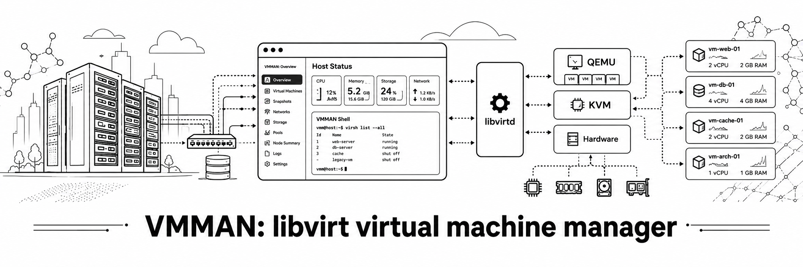

# 
___

This tool is a CLI-driven client to Nexus Repository Manager 3 servers.<br>It will allow:
- authentication
- blob store ops (list, delete, create)
- user + role ops (list, delete, create, edit)
- repo ops (list, delete, create, edit, upload+download package)
- more to come

**TABLE OF CONTENTS**<br>

[Basic Nexus Concepts](#concepts)

[Build / Install requirements](#build-install-requirements)

[Using the tool](#using-the-tool)

[Command summary](#command-summary)
- [Blobs operations](#blobs-ops)
- [Assets operations](#assets-ops)
- [Repositories operations](#repos-ops)

<a id="concepts"></a>
# Basic Nexus Concepts
Nexus Repository Manager (NxRM) is a repository tool to host all of your development artifacts, whether they are distro-specific binary packages (rpm, deb, etc), docker images, free form artifacts, etc

This tool is being developed while using NxRM OSS v3.90.2-06 so it does not support repo formats newer than that.
The tool will eventually support newer types as I become aware of the new formats. If you think that support is needed ASAP, you can drop me a line at the [Nxtools support email address](mailto:nxtools-support@famillegratton.net).


## Blob stores
The artifacts (called **assets**) are physically stored in blob stores; those stores can be filed-based (thus locally, on the NxRM host filesystem), or hosted on the cloud (GCP and AWS).<br>
`nxtools` currently only supports file-based blob stores

## Repositories
This is what everything in NxRM revolves around. Each repo uses its own specific format. To see which repo format is currently supported, have a look at the [doc](docs/ROADMAP.md)

## Assets
The basic block in NxRM. Every single piece (binary package, file, metadata, etc) that gets into a repo is an asset.

## Tasks
Tasks are executed on-demand or through an internal scheduler. `nxtools` currently offers limited support for tasks, but it will get expanded over time

## Roles and privileges
Roles are the basic access control items in NxRM and are heavily granularized. Privileges is a collection of roles grouped together for convenience.
Roles and privileges (or user management, for that matter) are not yet implemented in `nxtools`.

<a id="build-install-requirements"></a>
# Build/install requirements

You have three alternatives:
- [Install from source](#install-from-source)
- [Install from a binary package](#install-from-a-binary-package)
- [Build your own APK, DEB, RPM packages, then manually install those packages](#build-your-own-package)

Installing from source requires a bit more work in the sense that GO has to be installed on your system

<a id="install-from-source"></a>
## Install from source
1. Clone/fork the repo : either `git clone https://github.com/jeanfrancoisgratton/nxtools` or `git clone https://git.famillegratton.net:3000/devops/nxtools`
2. Ensure that you have the proper GO version, as stated in the `go.version` file in the root of the repo. Your GO version should be equal or higher than the one in that file. To ensure, run `go version`
3. cd to `src`, and then run: `./updateBuildDeps.sh`, to ensure that all build dependencies are up to date; this might be overkill, but I always run it nonetheless
4. run `./build.sh`. By default, the binary will be created in /opt (check the dir's permission ahead of running it). Examine that script, you can taylor the output as you see fit

<a id="install-from-a-binary-package"></a>
## Install from a binary package
The simplest way : just go in the RELEASES tab of the repo, select your format, download it, and then install throught you package manager

<a id="build-your-own-package"></a>
## Build your own package
The scripts and files (__alpine/, __debian, nxtools.spec) are there for my own ease of work; I usually build my tools using "builder containers" for each format: `apkbuilder`, `debbuilder`, `rpmbuilder`
I'll leave you with homeworks, and will show you how to roughly reproduce my environment

**The three methods below assume that you have forked (not just cloned) the repo somewhere**

### APKBUILDER : Alpine Linux
1. In an Alpine container or VM, you need the following packages: `abuild-doc pax-utils git alpine-sdk`. Some other packages might be needed, depending on the config in __alpine/APKBUILD
2. From the `__alpine`, run: `abuild -r`

This should give you an Alpine package

### DEBBUILDER : Debian-based distros (Debian, Ubuntu, Mint, etc)
1. cd to `__debian`
2. Besides binutils, you do not need any specific package, and of course the required GO version. Have a look at `../go.version`, and `./1.install-build-deps.sh`.
3. Run `./2.build_binary.sh`
4. Copy the .deb file in a safe space, then run `./restore_repo.sh`

### RPMBUILDER : RedHat-based distros (RedHat, CentOS, Fedora, RockyLinux, OpenSUSE)
**FORK OR COPY the repo, do not CLONE** it; there's a step there that would fail, otherwise (see step #4)
1. Ensure that tito is installed; the easy way is with pip: `pip install tito`
2. Ensure that all other build deps are installed; from the nxtools root directory, run: `./rpmbuild-deps.sh`
3. Run the following: `tito tag --keep-version`
4. Run the following: `git push --follow-tags origin` --> **This has to be done from a forked repo, otherwise if you point at my own repo, it will likely fail**
5. Run the following: `tito build --rpm` : the result will be in /tmp/tito/ copy the files (SRPM, RPM) in a safe place

<a id="using-the-tool"></a>
# USING THE TOOL

## Creating the environment file
This tool constantly works in "admin mode", and in order to avoid having to repeatedly log in, you must create a credential file (called an environment file here).<br>
You can have as many environment files as you wish, for as many users, servers, etc, that you need. If no filename or `-e` flag is set, the default `defaultEnv.json` file will be created in `$HOME/.config/JFG/nxtools/`

To create the environment file, it's simple as `nxtools env create [ENVIRONMENTFILE_NAME]`; remember that you choose a name other than `defaultEnv` you will need to provide that name whenever you invoke nxtools, like this:<br>
`nxtools -e ENVIRONMENTFILE_NAME command`

When you create your file, you will be prompted for a host, username, password and optional comments :<br>


## Using environment variables
The tool will eventually support environment variables such as NEXUS_HOST, NEXUS_USER, NEXUS_PASSWD, but the config management code needs a bit of cleanup before I implement this

<a id="command-summary"></a>
# COMMAND SUMMARY

<a id="blobs-ops"></a>
## Blob operations
We support add, remove and list operations; update operations are not yet implemented. The current blob subcommands are:


### List blobs
Very simply: `nxtools blob ls`<br><br>


*A note about the Path column* : the column will not show any data for paths with relative values (that is: the blobstore path uses its default value, inside Nexus' $DATA_DIR)

### Delete blobs
`nxtools blob rm $BLOBSTORE_NAME`, as shown below<br><br>


*Note:* You will not be able to delete a blob store if Blobcount > 0 (that is: it is not empty)

### Create blob stores
Currently, only file-based stores are supported

```bash
[20:30:49|jfgratton@london:src]: nxtools blob add -h
Creates a blobstore from the server

Usage:
  nxtools blob add [flags]

Aliases:
  add, create

Examples:
nxtools blob add FLAGS blobstore

Flags:
  -h, --help            help for add
      --path string     File blob path
  -s, --softquota       Soft quota enabled or not
      --sqlimit int     Soft quota limit
      --sqtype string   Softquota type, 'spaceRemainingQuota' or 'spaceUsedQuota' (default "spaceUsedQuota")
      --type string     Blob type (file, gcp, amazon, azure, group) (default "file")

Global Flags:
  -e, --env string   Environment file to load in from $HOME/.config/JFG/nxtools (default "defaultEnv.json")
  -q, --quiet        Output will be as quiet as possible
```
A few notes, here:
1. Even though only the file-based type is currently supported, the --type flag is mandatory (so here, it'd be: `--type file`)
2. If you set `--sqlimit` and/or `--sqtype` are set but `--softquota` is not, those two parameters will be ignored
3. if `--path` is unset, the blob path will be the `$DATA_DIR/blobs/$blobstore_name`; the path can be absolute, or relative to `$DATA_DIR/blobs`

<a id="assets-ops"></a>
## Assets operations
Some of the assets operations here work against repositories; both assets and repositories are kind of tightly-coupled. The supported (so far) operations are:


### Assets listing
Lists assets in a given repo
`nxtools assets ls [-a] [-l] REPONAME`

The flags:
- [-a] : lists alternate info than the usual one
- [-l] : only lists the latest versions of all packages

As you see with the image below, listing assets in a docker registry would only show the manifests; showing all the assets pertaining to a specific image would yield way too much info.<br>


If you need to list images and tags, use my other tool, [dtools2](https://github.com/jeanfrancoisgratton/dtools2) :

### Upload an asset (package) to a repo
The syntax is: `nxtools assets upload REPO_NAME /PATH/TO/PACKAGE`

A few notes worthy of attention :
- The same package could be re-uploaded multiple times without triggering an error (ie: launching `nxtools upload MY_REPO MY_PACKAGE 3 successive times is OK)
- If you were trying to upload a package of a wrong format (say RPM) in the wrong repo (say DEB) the current error message would be an http response 500. This will be enhanced in future versions

### Download an asset (package) from a repo
All you need is the download url, from `ntxools assets ls REPO_NAME`, as shown below:


### Assets information

There are two commands to show information about an asset, one is ID-based, the other is package_name-based

#### Asset-based information:
This one gives the most comprehensive information about an asset, but since it is ID-based, it will only give info about that specific version of the package (a repo can hold multiple versions of the same package)<br>
You can fetch the asset ID using `nxtools assets [-l] [-a] REPOSITORY_NAME`


#### Package name-based information
The information provided here is of more limited use. This is a quick lookup helper to see how many versions of a given package exist in the repo. This is much less cluttered than using `assets ls` :

```bash
[1:52:22|jfgratton@london:src]: ./build.sh;nxtools-documentation assets pkginfo aptLocal nxtools
Building /opt/bin/nxtools
╭────────────────┬───────────┬────────┬────────────╮
│ Component name │ Version   │ Format │ Repository │
├────────────────┼───────────┼────────┼────────────┤
│ nxtools        │ 0.30.00-1 │ apt    │ aptLocal   │
│ nxtools        │ 0.40.00-0 │ apt    │ aptLocal   │
│ nxtools        │ 0.50.00-0 │ apt    │ aptLocal   │
│ nxtools        │ 0.60.00-0 │ apt    │ aptLocal   │
│ nxtools        │ 0.62.00-0 │ apt    │ aptLocal   │
╰────────────────┴───────────┴────────┴────────────╯
```
### Delete an asset
You first need to fetch the asset ID from `nxtools assets REPOSITORY_NAME`. This subcommand allows you to delete multiple assets in a single stroke :


<a id="repos-ops"></a>
## Repositories operations
Refresh the repo metadata (reindex), remove and list operations are currently supported. Other operations are forthcoming.


### List repos
Again, very simply: `nxtools repos ls`


### Remove repos
Follows the usual pattern: `nxtools repo rm REPONAME`

**Please be aware that this operation is irreversible, and *will* delete non-empty repos**

### Reindex repos
This goes this way: `nxtools [repos] reindex REPONAME`
```bash
[21:01:34|jfgratton@london:packages]: nxtools reindex aptLocal
✅ Repository aptLocal was successfully reindexed
```

You use this operation after having uploaded a package to the named repository.
#### PRE-REQUISITES
`nxtools` has not yet implemented tasks creation, and might never do so (unsure of that, yet), so it calls upon tasks that **have to already be present through the webUI**
The task names have to follow this naming scheme: `_reindex_$REPONAME`, thus to reindex the repo `dnfLocal`, you would need to have a task named `_reindex_dnfLocal` already present